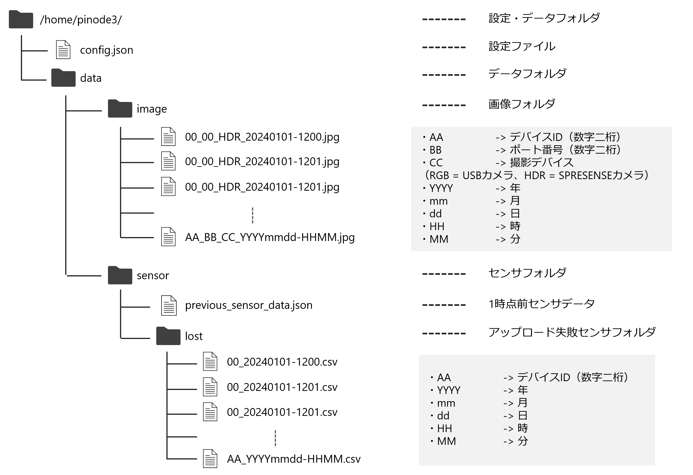

# PiNode3
PiNode3は農業ハウス内で動作するデータ収集システムです．

# インストール

### I2C有効化
温度，湿度，照度データはI2Cを用いて取得しています．Raspberry PiではデフォルトではI2Cからの通信を無効化しているため，
有効化させる必要があります．
``` bash
$ sudo raspi-config
```
3 Interfacing Options -> I4 I2Cと進み，YESを選択します．

### SPI有効化
果実径，茎径データはSPIを用いて取得しています．Raspberry PiではI2C同様無効化されているためこちらも有効化させます．
``` bash
$ sudo raspi-config
```
3 Interfacing Options -> I3 SPIと進み，YESを選択します．
I2C，SPIを有効化した後はリブートすることで適応されます．

### ソフトウェアインストール
本リポジトリをクローンし，ソフトウェアをインストールします．

リポジトリクローン
``` bash
git clone https://github.com/MinenoLab/PiNode3.git
```

インストール
``` bash
cd PiNode3
bash install.sh
```

以上でインストールは環境です．その他の設定等は[こちら]()を参照してください．

# データの確認
本ソフトウェアはInfluxDBを使用しています．そのためダッシュボードを作成することでセンサデータの確認を容易に行うことができます．
本章ではダッシュボードの作成方法を解説します．


# フォルダ構成
## Gitリポジトリ構成
クローンした際のリポジトリ構成を以下に示します．


## インストール後内部構成

