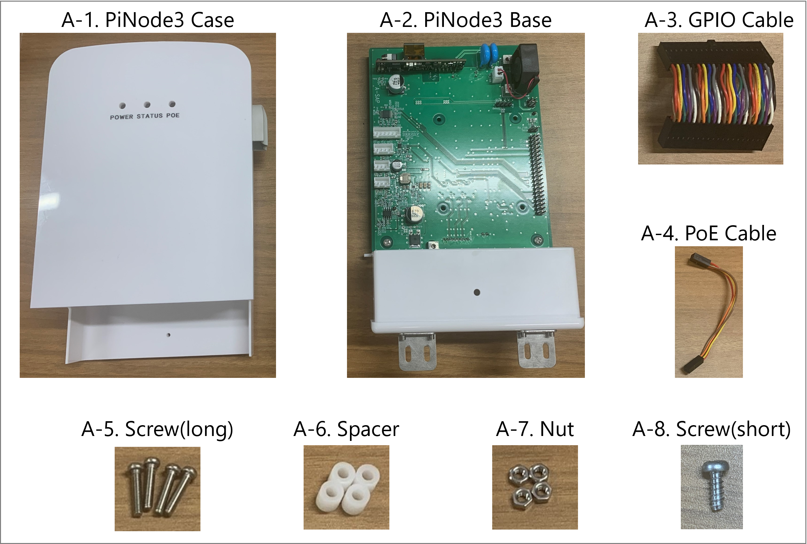
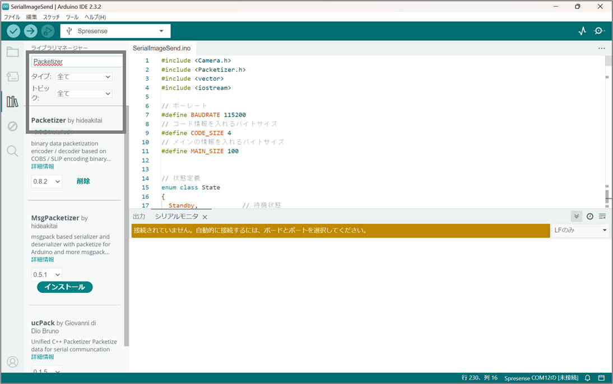

===================================
PiNode3 スタートガイド
===================================

事前準備物
-----------------------------------
1. Raspberry Pi 4 Model B+
2. MiscroSDカード
3. 標準センサ
4. 強制通風筒センサ
5. SPRESENSEカメラ

動作条件
-----------------------------------
- Raspberry Pi OS 64bit
 - **OS** : Debian GNU/Linux12 (bookworm)
 - **バージョンID** 12

ハードウェアの組み立て
-----------------------------------

物品名
~~~~~~~~~~~~~~~~~~~~~~~~~~~~~~

Raspberry Pi と PiNode3ケースの接続
~~~~~~~~~~~~~~~~~~~~~~~~~~~~~~~~~~~~~~~~

Raspberry Pi と A-2. PiNode3 Base、A-5. Screw(long)、A-6. Spacer、A-7. Nutを接続します。

.. image:: ../_static/setup/setup_1.png
    :width: 50%
    :align: center
    :alt: Raspberry Pi と メイン基板の接続

ファン、A-3. GPIO Cable、A-4. PoE Cableを接続します。

.. image:: ../_static/setup/setup_2.png
    :width: 50%
    :align: center
    :alt: Raspberry Pi と メイン基板の接続

PoE Cableは以下の向きで接続してください。

.. image:: ../_static/setup/setup_3.png
    :width: 50%
    :align: center
    :alt: Raspberry Pi と メイン基板の接続

メイン基板をA-1. PiNode3 Caseに赤枠のレールに沿って差し込みます。

.. image:: ../_static/setup/setup_4.png
    :width: 50%
    :align: center
    :alt: Raspberry Pi と メイン基板の接続

これでハードウェアの組み立ては完了です。

センサと電源の接続
~~~~~~~~~~~~~~~~~~~~~~~~~~~~~~

センサと電源を写真に記載された通りに接続します。

.. image:: ../_static/setup/sensor_connect.png
    :width: 50%
    :align: center
    :alt: Raspberry Pi と メイン基板の接続

以上でハードウェアセットアップは完了となります。

Raspberry Pi OS インストール
-----------------------------------
Raspberry Pi Imagerを用いてRaspberry Pi OSを書き込みます。

Raspberry Pi Imagerはこちらからインストールして下さい。
[Raspberry Pi Imager Download Link](https://www.raspberrypi.com/software/)

インストール後以下の設定でRaspberry Pi OSをインストールします。
- Raspberry Pi デバイス：Raspberry Pi 4
- OS : Raspberry Pi OS (64bit)
- ストレージ : 事前に用意したMicroSDカード
この時、追加の設定項目としてWiFiの設定とSSHの許可をしておくと後々便利です。

これでRaspberry Pi OSのインストールは完了です。

PiNode3 ソフトウェアインストール
-----------------------------------

Raspberry Pi へソフトウェアをインストールします。

アクセス
~~~~~~~~~~~~~~~~~~~~~~~~~~~~~~
電源を入れたRaspberry Pi に対してSSH接続を行います。今回は以下の条件を想定しています。

I2C有効化
~~~~~~~~~~~~~~~~~~~~~~~~~~~~~~
温度、湿度、照度データはI2Cを用いて取得しています。Raspberry PiではデフォルトではI2Cからの通信を無効化しているため，有効化させる必要があります。

.. code-block:: shell

    $ sudo raspi-config

3 Interfacing Options -> I4 I2Cと進み、YESを選択します。

SPI有効化
果実径、茎径データはSPIを用いて取得しています。Raspberry PiではI2C同様無効化されているためこちらも有効化させます。

.. code-block:: shell

    $ sudo raspi-config

3 Interfacing Options -> I3 SPIと進み、YESを選択します。I2C、SPIを有効化した後はリブートすることで適応されます。

本リポジトリをクローンし、ソフトウェアをインストールします。

リポジトリクローン
~~~~~~~~~~~~~~~~~~~~~~~~~~~~~~

.. code-block:: shell

    git clone https://github.com/MinenoLab/PiNode3.git

インストール
~~~~~~~~~~~~~~~~~~~~~~~~~~~~~~

.. code-block:: shell

    cd PiNode3
    bash install.sh

以上でインストールは完了です。その他の設定等は :doc:`../software-reference/configuration` を参照してください。

データ取得等の確認は以下を参考にしてください。 

- センサ値 :doc:`../utilization/index` 
- カメラ画像 :doc:`../software-reference/directory_structure`

SPRESENSEカメラの設定
-----------------------------------

SPRESENSEカメラを使用するためには、PCを用いて各種設定を書き込む必要があります。

ソフトウェアインストール
~~~~~~~~~~~~~~~~~~~~~~~~~~~~~~

GitHubからソフトウェアのインストール

はじめにPC上にボード上に書き込むプログラムをダウンロードします。

.. code-block:: shell

    git clone https://github.com/MinenoLab/PiNode3-SPRESENSE.git

続いて、PCからボードに対して各種設定等を書き込むためのアプリケーションをインストールします。

Arduino IDE
~~~~~~~~~~~~~~~~~~~~~~~~~~~~~~

Arduino IDEはPCからSPRESENSEに対してプログラムを書き込むためのアプリケーションです。以下のリンクからダウンロードしてください。

`Arduino IDEダウンロード <https://developer.sony.com/spresense/development-guides/sdk_set_up_ja.html>`_

上記リンクを開くと下記のようなサイトが開かれます。

.. image:: ../_static/setup/arduino_ide.png
    :width: 50%
    :align: center
    :alt: Arduino IDEダウンロード

サイトの下記項目を実行してください。

- 1.2 Arduino IDEのinstall
- 1.3 USBドライバのインストール
- 1.4 SPRESENSE Arduino board packageのinstall
- 2.1 USBシリアルポートの接続
- 2.2 SPRESENSEブートローダーのinstall

サイト内の下記画像位置まで実行できればOKです。

.. image:: ../_static/setup/arduino_ide_install.png
    :width: 50%
    :align: center
    :alt: Arduino IDEダウンロード

続いてArduino IDE内で使用するライブラリのインストールを行います。

Packetizerのインストール
~~~~~~~~~~~~~~~~~~~~~~~~~~~~~~

Packetizerはカメラ画像を送信する際に利用するライブラリです。
タブ-ツール/ライブラリに移動し、Packetizerを検索しインストールしてください。

次にSPRESENSE側の各種設定を変更します。
タブ-ツール/Memoryから以下のようにメモリサイズを変更してください。

768KB(default) -> 1536KB

.. image:: ../_static/setup/memory_size.png
    :width: 50%
    :align: center
    :alt: メモリサイズ変更

ボード書き込みエラー
~~~~~~~~~~~~~~~~~~~~~~~~~~~~~~

インストール環境によりpgmspace.hが存在せず、エラーが発生する場合はあります。
エラーの解決のためには以下の手順を実行してください。

1. 以下のリンクからpgmspace.hをダウンロードしてください。

`pgmspace.hダウンロード <https://github.com/Patapom/Arduino/blob/master/Libraries/AVR%20Libc/avr-libc-2.0.0/include/avr/pgmspace.h>`_

2. ダウンロードしたpgmspace.hを以下のディレクトリにコピーしてください。

Arduino/libraries/FastFRC/src/pgmspace.h

ボード書き込み
~~~~~~~~~~~~~~~~~~~~~~~~~~~~~~

以上の設定が完了したら、SPRESENSEにプログラムを書き込みます。

SPRESENSEボードとの接続
~~~~~~~~~~~~~~~~~~~~~~~~~~~~~~

はじめにPCとSPRESENSEボードをUSBケーブルで接続します。
接続が完了するとArduino IDEのツールバーにポートが表示されます。

.. image:: ../_static/setup/arduino_port.png
    :width: 50%
    :align: center
    :alt: Arduino IDEポート

ブートローダーの書き込み
~~~~~~~~~~~~~~~~~~~~~~~~~~~~~~

書き込み対象のSPRESENSEを選択したら以下から書き込みを行います。
タブ-ツール/ブートローダーを書き込む

.. image:: ../_static/setup/bootloader.png
    :width: 50%
    :align: center
    :alt: ブートローダー書き込み

下記のようなメッセージが表示されれば成功です。

.. image:: ../_static/setup/bootloader_success.png
    :width: 50%
    :align: center
    :alt: ブートローダー書き込み成功